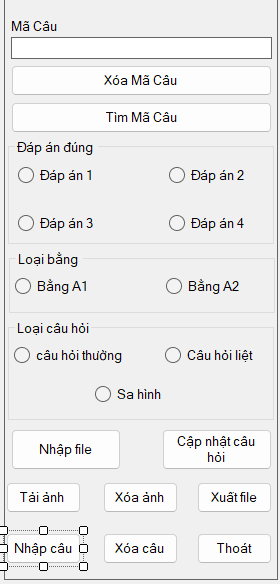

đây là 1 project Winform đề thi trắc nghiệm bằng lái xe đơn giản do mình và 2 người bạn chung nhóm làm để thi cuối kì.

từ ghi tắt: mk: Mật khẩu
            tk: tài khoản

Hướng dẫn setup:
1. tải file về

2. tạo database
   -  Ở phần Connect to Server, chọn SQL Server Authentication để kết nối bằng tài khoản sa.
   -  Nếu bạn không có tài khoản sa vàvà không biết cách thiết lập, hãy tham khảo video này:[ Cách thiết lập tài khoản sa.](https://youtu.be/ftVcBoZRAMA?si=OCTVIVL-6kRk6XG-)
  
   -  Sau khi kết nối thành công, vào mục Database.
   -  Tìm và mở file Query như hình minh họa: .
   -  Bấm vào Query, thực hiện lệnh Execute (nhấn F5) để chạy các câu lệnh trong file.
   -  Đảm bảo rằng dữ liệu bảng thi đã được thêm thành công.
   -  Sau khi hoàn tất, bạn có thể chuyển sang bước tiếp theo.

3. tạo kết nối trong visual
   -  bấm vào Winform_App_thi_trac_nghiem.sln
   -  sau khi trình IDE tải code xong, ta vào mục Solution Explore
   -  ở mục Solusion Explore ta sẽ thấy 4 project: SQLData, SQLLogic, Userlogin và Winform_App_thi_trac_nghiem
   -  vào project SQLData, ta sẽ có 2 class là: Data.cs và LayDuLieu.cs
   -  vào Data.cs, ta sẽ có 2 modun kết nối dữ liệu, tại đây bạn sẽ đổi lại kết nối theo cấu trúc như sau:

   -  public static string chuoiketnoi = "Data Source=Maychucuaban;Initial Catalog=DeThiTracNghiem;User ID=sa;Password=matkhaucuaban";
          
   -   public static Boolean ketnoiNdata()
   -   {
         clsData = new ClassDatabase();
         if(clsData.cnConnect != null)
         {
            clsData.SServerName = "Maychucuaban";
            clsData.SDatabase = "DeThiTracNghiem";
            clsData.SUsername = "sa";
            clsData.SPassword = "matkhaucuaban";
          }
        return true;
   -   }
   -   chú ý: phần Data Source và Password là mẫu để bạn nhập theo, đừng copy và dán vào đoạn code mà không chỉnh sửa lại. tương tự như vậy đối với SSevername và SPassword
   -   ở class LayDuLieu.cs bạn cũng làm y như vậy, nhưng đừng paste đoạn mã ketnoiNdata vào nha :)))      

4. nhập dữ liệu vào Database
   -  sau khi đã hoàn thành các bước trên, ta sẽ đến với project project Winform_App_thi_trac_nghiem.
   -  ở trong project, ta sẽ thấy 1 cái form với tên Form1.cs.
   -  bấm vào file đó, ta sẽ thấy giao diện nhập dữ liệu câu hỏi.
   -  để đến phần code, ta hãy bấm vào 1 phần tử bất kì trong giao diện đó (khuyến nghị nên bấm vào nút "Nhập câu" trên giao diện)
   
   -  sau khi bấm, đoạn code sẽ hiện ra và lúc này chúng ta sẽ thực hiện thao tác ở đoạn mã nhập file (nằm ở dòng 379)
   -  ở trong đoạn mã đó, phần tử filepath sẽ là phần tử chứa đường lưu đến file ecxel chứa dữ liệu câu hỏi
   -  lúc này, ta cần chỉnh sửa lại cấu trúc đường lưu như sau: @"C:\tenfileA\tenfilec\CauHoi1.xlsx"
   -  lưu ý: CauHoi1.xlsx là tên của file chứa dũ liệu câu hỏi, vui lòng không chỉnh sửa tên
   -  sau khi chỉnh sửa xong, chúng ta thực hiện chạy chương trình 
   -  sau khi chạy chương trình thì thứ mà ta quan tâm là nút nhập file trong cột này:
   -  
   -  sau khi nhấn nút nhập file thì nó sẽ hiện ra bảng thông báo nhập thành công, nếu nó không hiện hoặc nó hiện thông báo lỗi thì bạn hãy kiểm tra lại đường lưu
   -  sau khi nhập thành công thì ở dưới phần datagridview sẽ hiện ra danh sách câu hỏi. Lúc này bạn cần bấm vào nút "xử lí null" để thực hiện xóa những câu có đáp án 
      là null nhằm đảm bảo bài thi hoạt động trơn tru.
      
   -  sau khi hoàn thành hết các bước trên thì bạn đã set up xong, chúc bạn làm bài thi vui vẻ :)))
